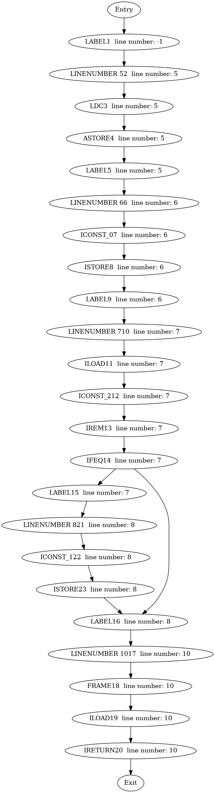
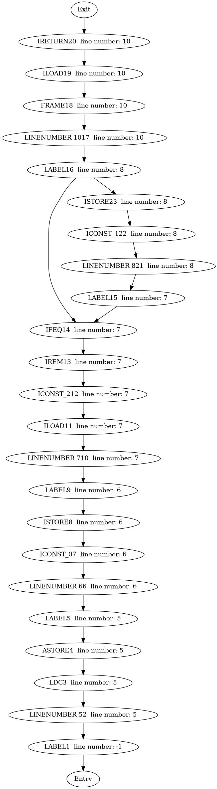
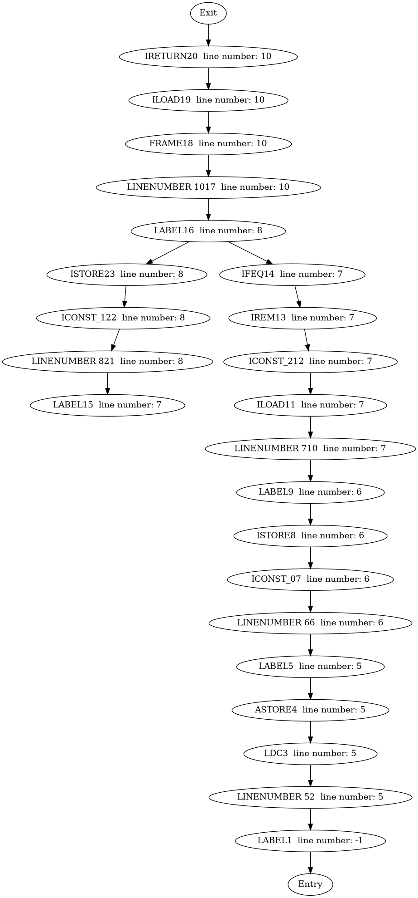
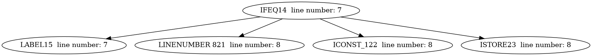
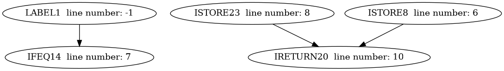
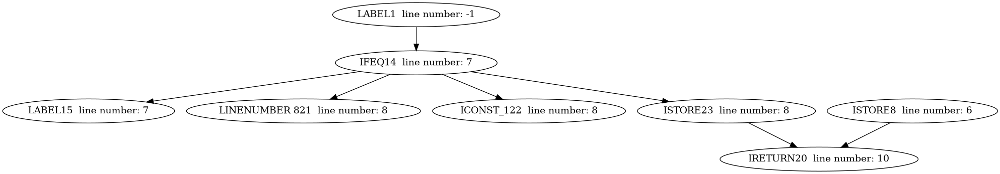

# Static and Dynamic Slicing — Software Analysis Course (University of Passau)

This project implements an **intra-procedural dynamic slicer** for Java programs at the bytecode level. The goal is to identify all program statements that may influence the value of a variable at a given point — the **slicing criterion** — by computing both **static** and **dynamic** slices.

## Overview

* **Static Slicing:**

    * Built upon the **Program Dependence Graph (PDG)**, constructed from:

        * **Control Flow Graph (CFG)**
        * **Reversed CFG**
        * **Post-Dominator Tree (PDT)**
        * **Control Dependence Graph (CDG)**
        * **Data Dependence Graph (DDG)** using **Reaching Definitions Analysis**

    * Static slicing is computed as a **backward slice** on the PDG.

* **Dynamic Slicing:**

    * Execution is traced to identify covered nodes.
    * A **reduced PDG** is built by pruning uncovered nodes and invalid edges.
    * The dynamic slice is computed as a **backward slice** on this reduced PDG.

For the complete task description, please refer to [Static&Dynamic_Slicing_Software_Analysis(SS25).pdf](Static%26Dynamic_Slicing_Software_Analysis%28SS25%29.pdf)


## Achieved Analysis Steps

* Reversed CFG construction
* Post-Dominator Tree computation
* Control and Data Dependence Graph construction
* Program Dependence Graph assembly
* Static backward slicing
* Dynamic backward slicing after execution tracing

### Simple Example

Given Java code:
```java
package de.uni_passau.fim.se2.sa.examples;

public class IsOdd {
    public boolean isOdd(int num) {
        String abandonedVar = "whatever";
        boolean isOdd = false;
        if (num % 2 != 0) {
            isOdd = true;
        }
        return isOdd;
    }
}
// -c de.uni_passau.fim.se2.sa.examples.IsOdd -m isOdd:(I)Z -v isOdd -l 8
```

Corresponding Control Flow Graph (CFG):



<details>

<summary>Reversed CFG</summary>



</details>

<details>

<summary>Post Dominator Tree (PDT)</summary>



</details>

Control Dependence Graph (CDG):



Data Dependence Graph (DDG):



Program Dependence Graph (PDG):




## Achieved Test Coverage
* Line Coverage: 85%
* Branch Coverage: 90%
* Mutation Score: 70%